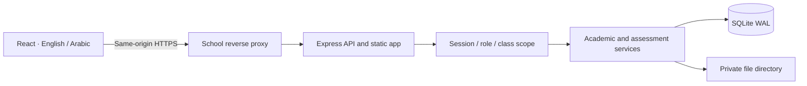

# Architecture

## Application boundary

CLASO is a single-school web application. One Express process serves both `/api` and the built React client. Development uses Vite middleware in that same process and origin. Production serves compiled static assets; no Vite development server runs in production.

## Repository layout

- `src/client/main.tsx`: authentication, layout, role navigation, command bar, hash routes
- `src/client/features/`: academic records, people, workspaces, assessment creation and attempts
- `src/client/components/`: reusable forms, tables, dialogs, state feedback, reference selection
- `src/client/i18n/`: centralized English/Arabic messages and locale/date/number formatting
- `src/client/styles/`: shared tokens, responsive layouts, logical CSS direction
- `src/shared/catalog.ts`: field metadata for consistent UI and API schemas
- `src/server/app.ts`: application construction, headers, login, middleware, error boundary
- `src/server/auth.ts`: password/session primitives and role/class policy
- `src/server/microsoft.ts`: tenant-restricted OIDC for administrator-approved student identities
- `src/server/teachers.ts`: transactional teacher account creation with academic assignments
- `src/server/domain.ts`: record visibility, validation, conflict checks, versioned updates
- `src/server/academic.ts`: academic CRUD, publication, archiving, year rollover
- `src/server/assessments.ts`: assignment submission, attempts, answer saving, grading, result release
- `src/server/people.ts`: account operations, safe CSV exports, validated imports
- `src/server/files.ts`: bounded uploads and access-controlled downloads
- `src/server/operations.ts`: operational queries, communication, search, health, audit
- `src/server/db.ts`: synchronous prepared statements and explicit transactions
- `migrations/`: ordered, transactional SQL migrations
- `tests/`: HTTP/database integration tests with isolated fixtures
- `scripts/`: administrator bootstrap, backup, optional product-film authoring

## Data access and transaction model

SQLite uses foreign keys, WAL mode, and a five-second busy timeout. Mutations that span records run within `BEGIN IMMEDIATE`. Dynamic identifiers come only from application-owned catalog metadata; values are bound parameters. Optimistic updates use `version` and return HTTP 409 on stale input. Database constraints backstop uniqueness and relationship validation.

The initial adapter uses Node 24's built-in SQLite API. Its calls are synchronous: this deployment is designed for one application process with local persistent storage. Benchmark realistic school traffic before rollout. A horizontally scaled deployment requires a different database adapter and cross-process operational design; placing SQLite on a shared network filesystem is not supported.

## Authentication and policy

Passwords are hashed with a random salt using `scrypt`. Login creates a random opaque token; only its SHA-256 digest is stored in SQLite. The browser receives an HttpOnly, SameSite=Strict cookie, Secure in production. Mutations require a session-bound CSRF header. Origin checks reject cross-origin writes.

Role and active account state are loaded from the server for every request. Class visibility uses teacher assignments or enrollments, including in list/search queries. Additional policy checks gate publication states, assessment windows, personal ownership, and historical write restrictions. No client-provided role changes server authorization.

## Frontend state and routing

The public home (`/` or `/#/home`) is separate from sign-in (`/#/login`) and the authenticated dashboard (`/#/workspace`). The narrated product film is self-hosted static media with a shared localized transcript. Hash routes allow direct links without a client-side routing dependency. Session and CSRF values are held in memory. Local storage contains only language and appearance preferences. HTTP state is loaded by abortable request hooks; forms preserve input after failures. React escapes school-authored text; no arbitrary HTML renderer is used.

Exam autosave serializes updates, tracks optimistic versions, and retries the retained in-memory draft after connectivity returns. Server deadlines remain authoritative. A 15-second maintenance interval finalizes expired attempts, and attempt retrieval also checks expiration.

## Localization and design

The first language is inferred from the browser; an explicit selection persists. Root `lang` and `dir` change together, while CSS uses logical margins/padding. Email/date entry uses explicit LTR controls. Display dates use the school timezone and selected locale; datetime form input is interpreted in the device's timezone and converted to UTC. Schedule clock times are school-local recurring times.

The system uses local font stacks and SVG assets. English and Arabic both use local fonts, with Tahoma/Segoe UI/Arial available for Arabic. No Google Fonts/CDN dependency exists. Shared colors, surfaces, borders, control heights, layers, and motion settings live in CSS tokens. Reduced motion is respected.

## Failure behavior

Errors carry a stable message key and request ID, not SQL or stack traces. Private API responses and downloads use `no-store`. No service worker caches authenticated data. The application needs server connectivity to commit work; it does not promise offline submission or persistent offline exam answers.
