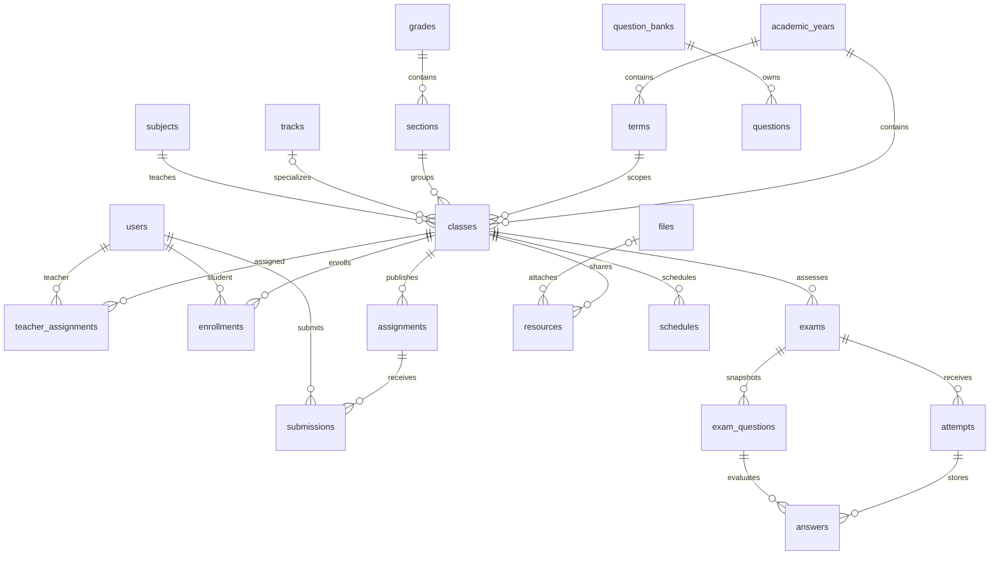

# Data model

The authoritative schema is `migrations/001_initial.sql`. Migrations execute once in filename order and are recorded transactionally.

## Identity and school

The deployment has one `school` row, with timezone and default locale. `users` holds administrator, teacher, and student identities; roles are constrained through `roles`. `permissions`/`role_permissions` document the fixed policy vocabulary. Server policy code is the enforcement authority. Sessions reference active users. No password or session token is returned in a people response.

## Academic structure

At most one year is active. Terms must fall inside their year. Classes reference a matching year and term, a section (which references a grade), an optional track, and a subject. Teacher assignments and enrollments are unique per class/person and validate user role. Schedule checks reject teacher/student/room overlaps; membership creation also checks existing timetables.

Years transition planned → active → archived. Classes can be archived. Rollover copies term dates (shifted to the new start), and class structure into a planned year. It does not copy accounts, teacher assignments, enrollments, work, or grades. An administrator reviews and completes the new year before activation. Historical records remain linked to the original year.

## Teaching and learning

Lessons and resources start as drafts. Resources hold a title, description, topic, class, uploader, time, optional protected file, and/or validated HTTP(S) URL. Publication grants access only within the class. Resource archives retain metadata and file references.

Assignments start as drafts, then publish. Availability is computed from UTC open/due times and late policy. Students make one immutable submission per assignment. Submission states are submitted → graded → returned. A teacher can save a grade privately before returning it. Students never receive unreleased scores or feedback. Complete assignments stop accepting submissions. Completion requires all received submissions to be returned.

## Exams and results

Question banks belong to a subject and author. Teachers operate their own banks within their assigned subjects. Question types are multiple choice, true/false, short answer, image, and equation. Image/equation/free-text responses require manual grading; image files use the normal private-file policy.

Adding a bank question to an exam creates a snapshot. Later bank edits do not change the exam. Question edits/additions/removals are allowed only while an exam is in draft. States are draft → review → scheduled/published → closed → results. Review/schedule can return to draft; published content cannot be silently changed.

Scheduling reserves the availability window; publishing exposes the assessment and enables attempts within that window. `Live` is a derived display state, not a second source of timing truth. Only one active attempt per student/exam exists. A deadline is the earlier of the configured duration and close time. Random question/option order is persisted on each attempt. Answer updates use optimistic versions. Expired or submitted attempts are immutable.

Automatic grading handles exact multiple-choice/true-false values; blank answers receive zero. Other answered types remain pending manual grading. Results can be released only after closure and all attempts are graded. Published result views derive grades directly from submissions/answers; there is no duplicate mutable grade ledger.

## Communication and audit

Announcements have a validated school/grade/section/track/class/user audience, publication date, optional expiration, and status. Teachers target their assigned classes. Notifications are event records with read timestamps. Messages are restricted to administrator communication or a teacher/student relationship through class membership. Inbox work tasks are derived from pending records.

Audit events store actor, action, record type/id, time, request ID, and minimal context. Password values, tokens, answer contents, and CSV passwords are not audit context. Import previews store password hashes temporarily, expire after 30 minutes, and clear stored rows after commit. Confirmed imports are idempotent during the preview retention window.

## Retention and deletion

There is no hard-delete endpoint for users, years, classes, assignments, or results. Foreign keys preserve historical relationships. A draft exam question snapshot can be removed before publication. Unattached uploads remain private and count toward the uploader quota. Storage cleanup and statutory retention decisions are operator responsibilities; see `docs/OPERATIONS.md`.

## External school identities

Migration `003_school_identity.sql` adds a unique optional administrator `login_id`, account/session authentication providers, and `external_identities` with `(tenant_id, object_id)` primary key and a unique user relationship. `oauth_requests` stores ten-minute, single-use state hashes, browser-cookie hashes, PKCE verifiers and nonces; expiration cleanup removes them. Provider tokens are not stored. These changes preserve all existing users and academic history.

## School management

Migration `004_school_management.sql` adds the `school_management` role and records separate academic, system, account-role and academic-audit capabilities. Existing user rows, credentials and memberships are unchanged. Only administrators create identities and update account roles. Role transitions preserve history, use account versions, revoke sessions and record actor/old/new roles in audit events.
